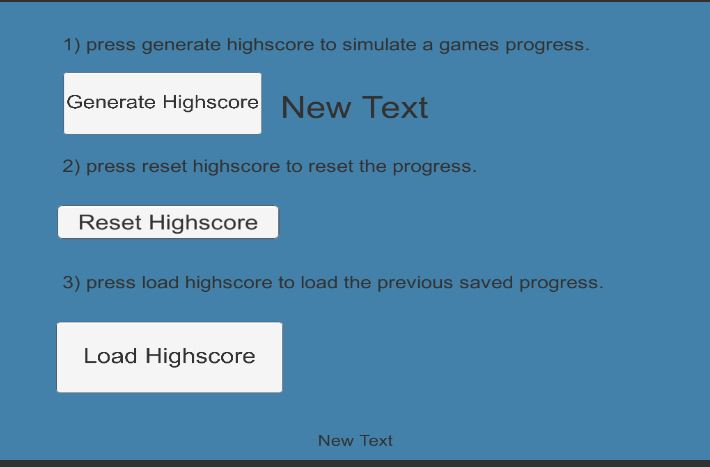

# smeerws-101SavingLoadingData

Example Scene for save and load data in Unity using xml. 
Tipp: Under Playersettings Company Name and Product Name the path for the xml file can be set. 

Dev-platform: Win 10, Unity Version: 2018.2.14f1, Visual Studio Version: VS Community 2017, 15.3.9;
Scripting Runtime Version: .NET 4.x Equivalent
API Compatibility Level: .NET Standard 2.0, 
Target platform: Standalone (Reference Resolution: 1024 x 768)

Third Party Material:
Load/Save Data https://github.com/renebuehling/GDP-Toolkit

